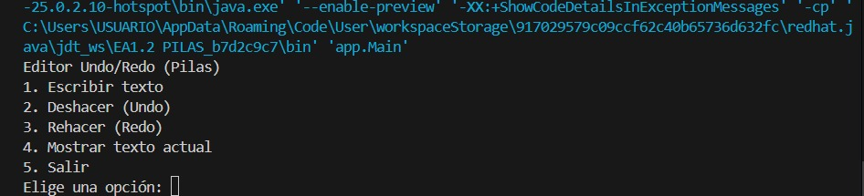
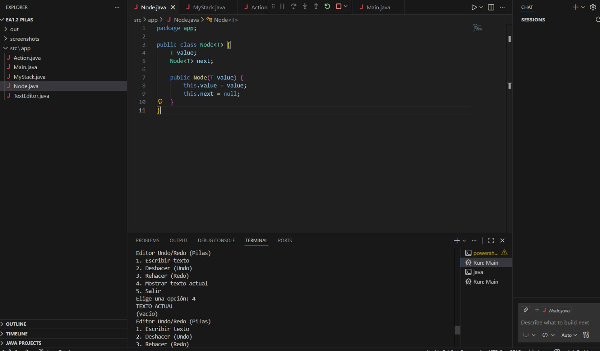
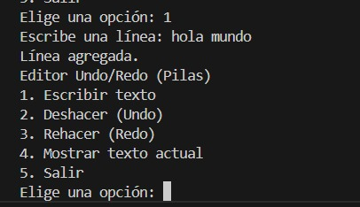
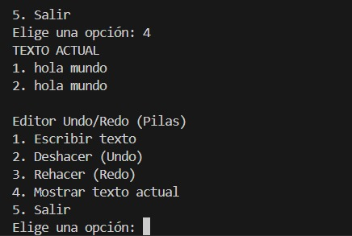
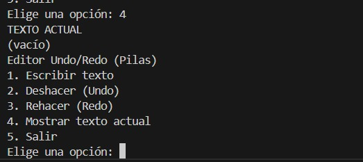
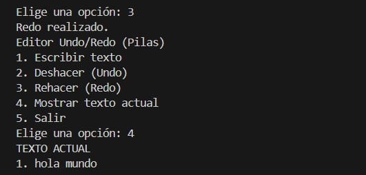

# EA1.2 - Pilas (Stack) | Undo / Redo en Consola

## Descripción

En esta actividad se implementa manualmente una estructura de datos tipo **Pila (Stack)** en Java, aplicándola en un simulador de **Undo/Redo** (Deshacer/Rehacer) en consola.

El programa permite escribir líneas de texto y utilizar dos pilas para gestionar las acciones realizadas y deshechas.

# Objetivo

- Implementar una pila manualmente (sin usar `java.util.Stack`).
- Aplicar las operaciones:
  - push()
  - pop()
  - peek()
  - isEmpty()
- Simular el funcionamiento de Undo/Redo usando dos pilas.

# Estructura del Proyecto

EA1.2 PILAS  
 ├── src  
 │    └── app  
 │         ├── Node.java  
 │         ├── MyStack.java  
 │         ├── Action.java  
 │         ├── TextEditor.java  
 │         └── Main.java  
 ├── screenshots  
 └── README.md  

# Funcionamiento

Se utilizan dos pilas:

- **Pila Undo:** Guarda las acciones realizadas.
- **Pila Redo:** Guarda las acciones deshechas.

# Flujo del programa:

- Cuando se escribe una línea:
  - Se agrega al texto.
  - Se guarda la acción en la pila Undo.
  - Se limpia la pila Redo.

- Cuando se hace Undo:
  - Se elimina la última acción.
  - Se mueve a la pila Redo.

- Cuando se hace Redo:
  - Se recupera la acción desde Redo.
  - Se vuelve a guardar en Undo.

# Cómo ejecutar el proyecto

# Compilar

Desde la carpeta raíz del proyecto:

javac -d out src/app/*.java

# Ejecutar

java -cp out app.Main

# Capturas de ejecución

# Menú inicial

# Código funcionando

# Escribiendo texto

# Mostrando texto

# Undo funcionando

# Redo funcionando

# Autor

**Felipe Carmona Jiménez**  
Ingeniería en Software y Datos  
Institución Universitaria Digital de Antioquia  
Actividad EA1.2 - Estructura de Datos: Pilas (Stack)

# Conclusión

Esta actividad permitió comprender el funcionamiento interno de una pila y cómo puede aplicarse en situaciones reales como la gestión de cambios en un editor de texto. La implementación manual ayudó a reforzar el entendimiento de estructuras de datos dinámicas y su comportamiento LIFO (Last In, First Out).

